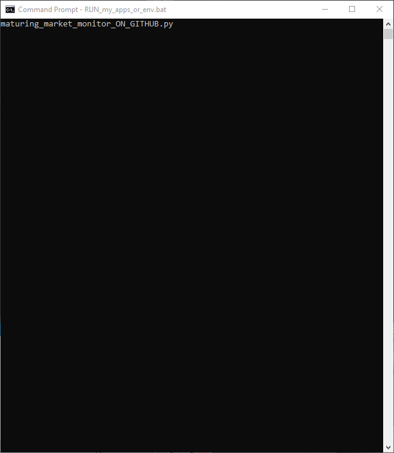

# WIG-index-components-monitor-and-stocks-picker
WIG monitor and picker - recommends best valuated components of index (WIG) on Warsaw Stock Exchange(WSE).

WSE is a (emerging/maturing) stock exchange in Poland (developed market by World Bank).
WSE is the largest Stock Exchange in the Central-Eastern European zone (CEE).

Application scraps information about components of WIG index.
Individual stock details are presented and recommendaiton provided.

For gradual presentaiton: actual code, scraps only 1st page from stooq.pl.
(When needed increase page number -> see main function.)

When internet connection not available, reads locally stored json file which was stored in previous time.

Usage: run the script when connected to internet.

Written for Windows, Python 3.8, end of year 2019 - time when many WIG stocks valuation is very good and US dollar seems to be at its peak.

Please see below demo video (gif) which shows usage.

